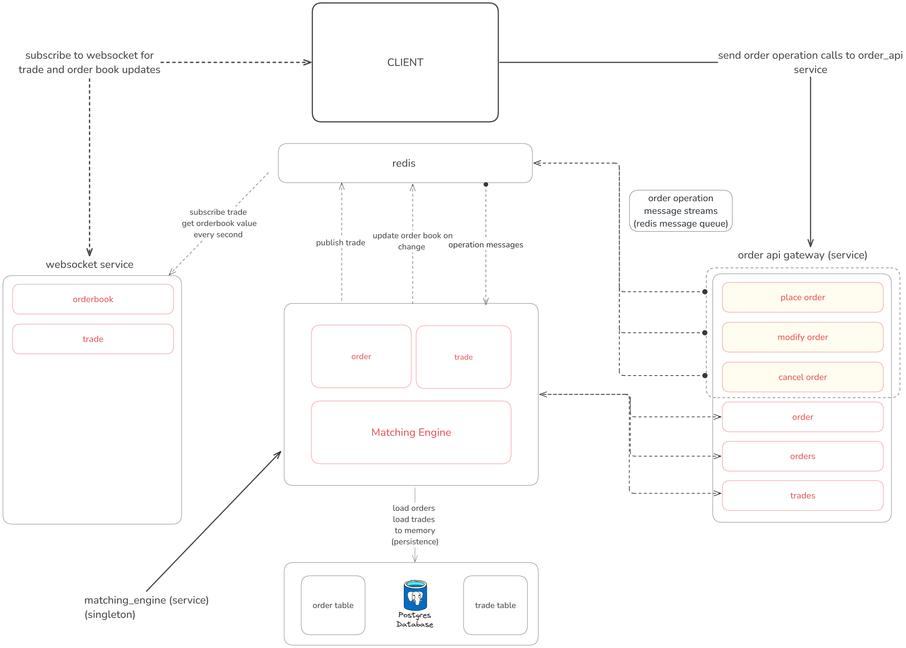

# Order Matching Engine Documentation

To get started with the system, simply run:

```bash
docker-compose up --build
```

Then, import the `OrderMatchingAPI.postman_collection.json` file into Postman to test the API endpoints for placing, modifying, canceling, and fetching orders and trades. For real-time updates, you can connect to the following websockets:

- Trades: `ws://localhost:8080/ws/trades`
- Order Book: `ws://localhost:8080/ws/orderbook`

### Overview

This system is built on a microservices architecture. At its heart is the Engine Service, which continuously runs and matches incoming orders against resting ones based on the best available prices. The Order Service acts as the API gateway that takes client requests and sends them to the engine using Redis Streams. Finally, a WebSocket Service broadcasts trade updates and order book snapshots to connected clients.

The tech stack includes:
- **Postgres** for persistent storage,
- **Redis** as the in-memory database and for message queues (using both Streams and Pub/Sub),
- **FastAPI** as the web framework,
- **SQLAlchemy** for ORM
- **Docker** To containerize


### Engine Service

The engine is designed as a singleton to ensure that only one instance handles the matching logic. This approach is used to maintain a single, consistent in-memory state across the application, preventing conflicts and race conditions during order matching. Concurrency is managed with thread locks to make sure that operations like placing, modifying, or canceling an order do not interfere with each other.

#### Data Structures

- **Orders Dictionary:**  
  A central dictionary holds all orders, where each order is stored with its unique `order_id` as the key. For example:
  ```python
  orders = {
      "order_id_1": Order(...),
      "order_id_2": Order(...),
      # more orders
  }
  ```

- **Bid and Ask Levels:**  
  Two separate dictionaries store the active orders based on their side:
  - **Bid Levels:** Used for buy orders, with the key being the price and the value being an `OrderedDict` of orders. This ensures that orders are processed in a First-In-First-Out (FIFO) order at each price level. For instance:
    ```python
    bid_levels = {
        100: OrderedDict({
            "order_id_1": Order(...),
            "order_id_3": Order(...),
        }),
        99: OrderedDict({
            "order_id_4": Order(...),
        }),
    }
    ```
  - **Ask Levels:** Used for sell orders, similarly structured with price keys and `OrderedDict` values. For example:
    ```python
    ask_levels = {
        101: OrderedDict({
            "order_id_2": Order(...),
            "order_id_5": Order(...),
        }),
        102: OrderedDict({
            "order_id_6": Order(...),
        }),
    }
    ```

- **Best Price Markers:**  
  The engine keeps track of the best bid and best ask prices for quick access during matching. This allows the matching process to efficiently identify the most favorable prices for trade execution.

- **Trades List:**  
  A list is used to store all trade objects generated during the matching process, for example:
  ```python
  trades = [
      Trade(...),
      Trade(...),
      # more trades
  ]
  ```

These data structures allow the engine to quickly insert, remove, and look up orders while maintaining the order of execution. They are essential for efficient order matching and real-time updates.

#### Design Pattern: Singleton

The engine follows the Singleton design pattern. This pattern ensures that there is only one instance of the MatchingEngine class running at any time. The primary reasons for choosing this pattern are:

- **Consistent State:** With a single instance, all operations are performed on one unified in-memory state, reducing the risk of conflicts and making state management simpler.
- **Centralized Control:** It simplifies concurrency control since there's one point of access to the order book and related operations.
- **Resource Efficiency:** Avoids the overhead of creating multiple instances when a single, shared instance is all that is needed to manage the order matching process.

#### Persistence and Notifications

Persistence is achieved with Postgres using SQLAlchemy. Every order and trade is saved so that the system can rebuild its in-memory state on startup. Redis is used for two main purposes:
- **Trade Notifications:** When a trade occurs, the engine publishes a message to a Redis channel, which the WebSocket Service listens to.
- **Order Book Snapshot:** The latest snapshot of the order book is stored in Redis as a JSON document for quick access.

#### Core Operations

- **Placing an Order:**  
  When you place an order, the engine creates a new order object, attempts to match it against existing orders, and—if it still has remaining quantity—inserts it into the order book. The order is then saved to the database, and the order book snapshot in Redis is updated.

- **Modifying an Order:**  
  The engine first removes the existing order from its current price level, updates the price, reattempts matching, and then reinserts it if necessary. All changes are saved to the database and reflected in the Redis order book snapshot.

- **Canceling an Order:**  
  Canceling an order removes it from the order book, marks it as inactive, and updates the database. The order book snapshot is refreshed afterward.

- **Matching Logic:**  
  For a buy order, the engine matches it against the lowest ask prices available that meet the price condition (ask price ≤ buy price). For a sell order, it does the opposite, matching against the highest bid prices (bid price ≥ sell price). Within each price level, orders are processed in a FIFO manner. Trades are generated based on the minimum quantity between the incoming and resting orders, and both orders are updated accordingly. Each trade is persisted, and notifications are sent via Redis.

- **Order Book Snapshot:**  
  The engine generates a snapshot by aggregating the top five bid and ask levels, summing up the remaining quantities at each level. This snapshot is then stored in Redis with a timestamp for the WebSocket Service to access.

#### Time Complexity

- **Insertion and Removal:**  
  Adding or removing an order is generally O(1) because it involves simple dictionary operations.

- **Matching Orders:**  
  Accessing the best price is O(1), but matching may need to scan through several price levels and orders at each level. In the worst case, this could approach O(n*m) (where n is the number of price levels and m is the number of orders per level), though in practice the operation is fast since it typically deals only with the best available levels.

- **Order Book Snapshot:**  
  Creating a snapshot involves sorting the price levels (O(n log n)) and then aggregating the quantities at the top five levels, which is efficient because the number of levels to process is constant (5).


